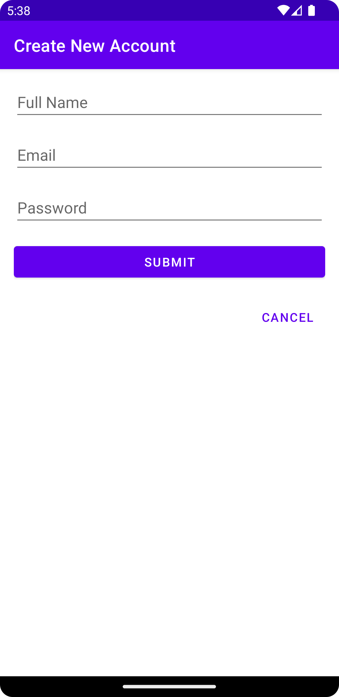
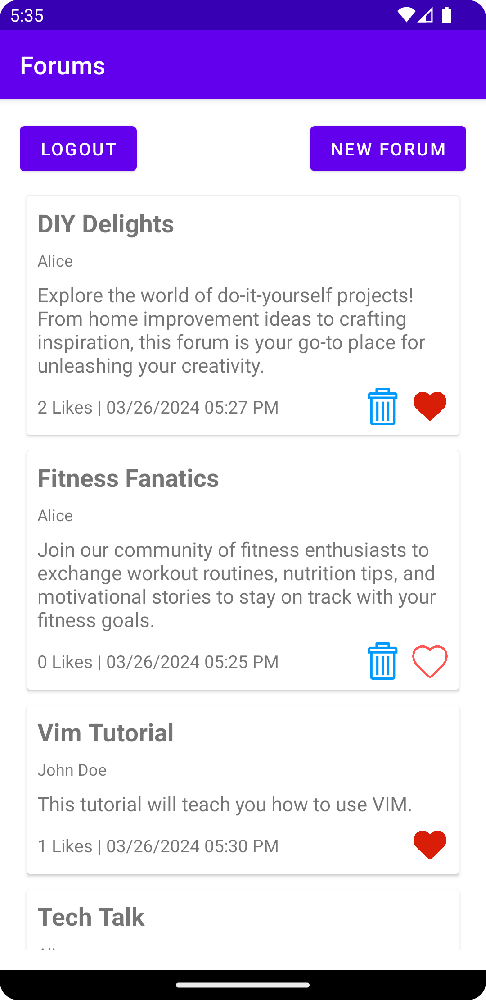
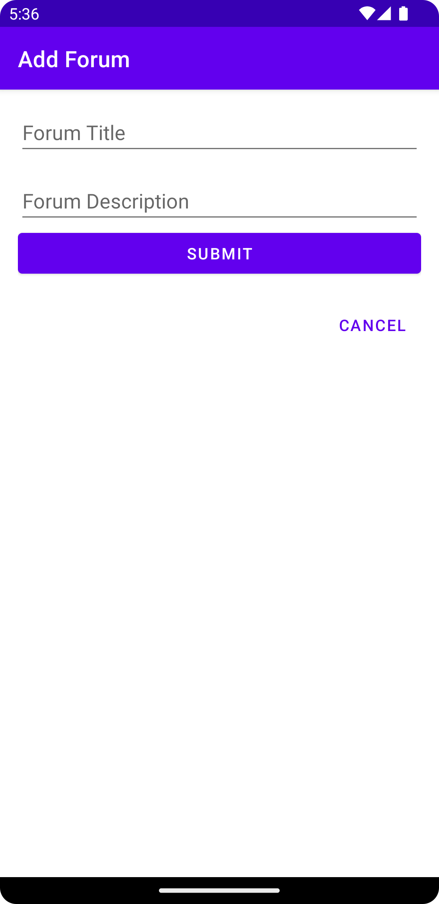
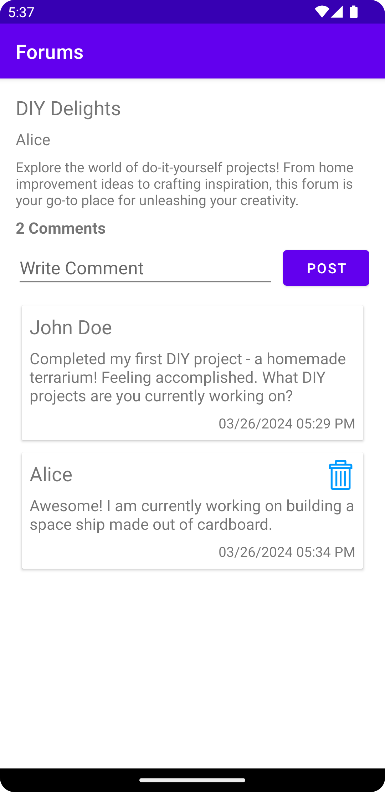

# Forums App

The Forums App enables users to list, create, and delete forums, leveraging Firebase Firestore to manage forum data and user accounts. The app architecture includes a single Activity and multiple fragments to implement various screens.

## Screens and Functionality

### Part 1: Login Fragment 
- Interface matches the UI presented in Fig. (a).
- Clicking "Create New Account" replaces the current fragment with the Create New Account Fragment.
- Clicking "Submit" validates email and password fields. Alerts the user if any field is missing.
  - Uses Firebase Auth for login. Successful login replaces the fragment with the Forums Fragment.
  - Displays an alert dialog for unsuccessful logins with Firebase Auth errors.

### Part 2: Create New Account Fragment 
- Interface matches the UI presented in Fig. (b).
- Enables user registration with email and password.
- Clicking "Cancel" dismisses the screen and shows the Login Fragment.
- Clicking "Submit" validates fields. Alerts the user if any field is missing.
  - Uses Firebase Auth for registration. Successful registration replaces the screen with the Forums Fragment.
  - Displays an alert dialog for unsuccessful registrations with Firebase Auth errors.

### Part 3: Forums Fragment 
- Interface matches the UI presented in Fig. (c).
- Displays a list of forums fetched from Firestore.
- Implements realtime updates for forum list.
- Provides options to logout, create a new forum, and view forum details.
- Each forum item includes title, creator name, description, and creation date.
- Users can delete forums they've created.
- Users can like/unlike forums.
- Clicking on a forum item displays the Forum Fragment with details.

### Part 4: New Forum Fragment 
- Interface matches the UI presented in Fig. (d).
- Clicking "Cancel" returns to the Forums Fragment.
- Clicking "Submit" validates fields. Alerts the user if any field is missing.
  - Stores a new forum on Firestore upon successful submission.
  - Refreshes the forums list upon returning to the Forums Fragment.

### Part 5: Forum Fragment 
- Interface matches the UI presented in Fig. (e).
- Displays forum details and comments fetched from Firestore.
- Implements realtime updates for comments.
- Users can delete their own comments.
- Provides an option to post new comments.
- Pressing the back button returns to the Forums Fragment.

## Screenshots
<table>
  <tr>
    <td>
      

        
         
        <em>(a) Login Fragment</em>
      

    </td>
    <td>
      

        
         
        <em>(b) Sign-up Fragment</em>
      

    </td>    
    <td>
      

        
         
        <em>(c) Forums Fragment</em>
      

    </td>
  </tr>
  <tr>
    <td>  
      

        
         
        <em>(d) Create Forum Fragment</em>
      

    </td>
    <td>
      

        
         
        <em>(e) Forum Fragment</em>
      

    </td>
  </tr>
</table>

## Technologies Used
- Java
- XML
- Firebase Authentication
- Firebase Firestore
- RecyclerView
- Fragments

## How To Run
- Clone this repository.
- Open `forums-app` folder in Android Studio.
- Run the app.
